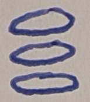
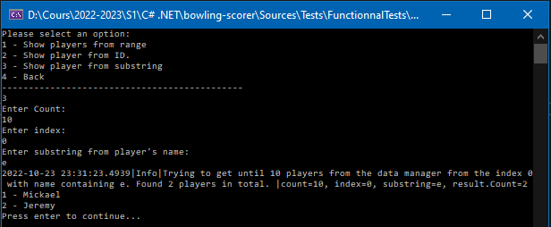

 

# Bowling Scorer

👋 Welcome on the bowling-scorer project! 👋  

The objective of this project is to create a mobile app to save the scores of bowling games. Players and scores can be entered in the application so as to provide statistics on the games played, winners, and thus allow players to follow their progress.  

## Features

- [x] Each player can create his profile with a nickname and a customizable and editable photo.
- [x] It is possible to create bowling games with as many players as possible.
- [x] The games are then completed as the players progress and the score is calculated in real time with an interactive scoreboard.
- [x] Players can view detailed stats on their profile and see which games they have played.
- [x] Parts as players can be deleted or edited.
- [x] The structuring of the project allows in the future the implementation of several rules of bowling, and it remains possible at any time to consult these rules.

## Installation Instructions *(In progress)*
> ⚠️ This section will be awailable when the project will be complete.

## Usage instructions
* Clone this repository
* Open the file `Solution.sln` in Visual Studio present in the `Source` folder.
* You can now run the project and the unit tests. 

## API Reference
* [.Net 6](https://learn.microsoft.com/en-us/dotnet/fundamentals/)
* [Entity Framework](https://learn.microsoft.com/en-us/ef/)

## Developper Guide

This project has been developed with a fine design leaving the possibility of adding other bowling rules in the future than those we know.

Before you start contributing to this project, please refer to the [Wiki](https://codefirst.iut.uca.fr/git/jeremy.tremblay/bowling-scorer/wiki/) explaining the structure and logic behind this repository. Here you will find the detail of the [model](https://codefirst.iut.uca.fr/git/jeremy.tremblay/bowling-scorer/wiki/Model) used in the application.

Also remember to respect the standard codings defined on the Microsoft site, and the organization set up on this repository.

🎉 Happy coding! 🎉

## Future app apparence
 
The app's main menu will look like this sketch. On the main menu, the user will be able to see the current game (if there is a current game), the past games by scrolling to tht bottom, ... In addition, the user can go on the other pages of the app by clicing on the  button. 
 
This application enable the user to see statistics of each player, here you can see a preview of a player profile in the application.

While waiting the mobile app, our application exists in console mode : 
 
Thanks to this version, you can list some players for example.

# Migrations
If you want to use the functionnal tests and the console app, you must to generate a migration of our database : 

* `cd Entities/`
* `dotnet ef migrations add BowlingDbMigration -c BowlingDbContext`
* `dotnet ef database update -c BowlingDbContext`

## Authors
* Mickaël DUBOIS - Mickael.DUBOIS@etu.uca.fr - [GitLab here](https://gitlab.com/omega2028)
* Jéremy TREMBLAY - jeremy-tremblay@outlook.fr - [Github here](https://github.com/JeremyTremblay2)

## Licence

We want to leave the possibility to other people to work on this project, to improve it and to make it grow, that's why we decided to place it under MIT license.

> Read more about the [MIT licence](https://fr.wikipedia.org/wiki/Licence_MIT).